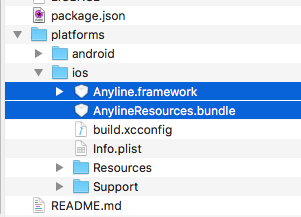
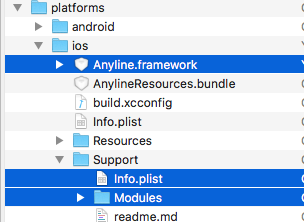
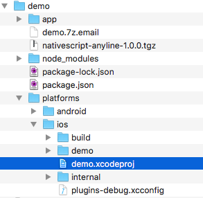
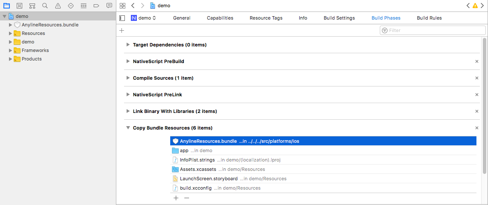
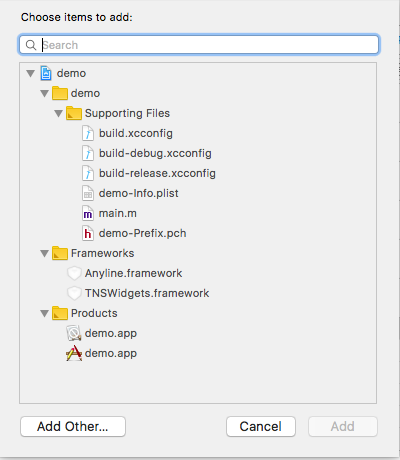
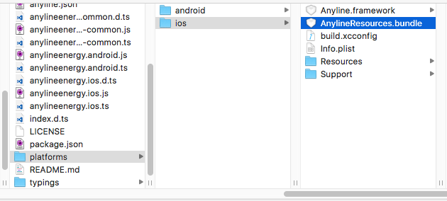

# NativeScript-Anyline
This plugin supports the Anyline scanning ability

## License
This plugin is licensed under the MIT license by Nathanael Anderson

## Limitations
- Currently only supports the Anyline.energy module
- iOS is not a simple to use Cocoapod yet, so it requires some manual installation...

## Installation
To install type 

```
tns plugin add nativescript-anyline
```
Then Copy the `anyline.json` file out of `/node-modules/nativescript-anyline` to your root /app folder; customize any settings you wish too.
If you don't it will use them as the defaults. Please note most things are customized via the JSON file.

### Additional iOS Installation
iOS is a bit more complex because the Cocoapod method is currently broken in Anyline for NativeScript.  
- You have to manually download the Anyline sdk from Anyline.io.
- You extract the sdk and copy/move the `Anyline.framework` and `AnylineResource.bundle` into your `/MyCoolApp/node_modules/nativescript-anyline/platforms/ios` folder.


- Once you the framework and resources files in that location; you need to MOVE the files from the `/MyCoolApp/.../nativescript-anyline/.../ios/Support` folder into the `Anyline.framework` as the framework is missing files that are needed for NativeScript to be able to generate the metadata it needs from the framework.



- Then do a `tns build ios` 
- Open XCode, and then open the `/MyCoolApp/Platforms/ios/mycoolapp.xcodeproj` or, if a workspace is present, then you need the `mycoolapp.xcworkspace` workspace file instead.



- Then click on "MyCoolApp" -> "Build Phases" -> "Copy Bundle Resources" and then click the **+** in the copy resources section



- Click the **Add Other** button at the bottom of the dialog screen.




- Then navigate to `MyCoolApp/node_modules/nativesscript-anyline/platforms/ios` and pick the `AnylineResource.bundle` file and click the **open** button.





- Finally click the **Copy Resource if needed** checkbox and click the add button.

At this point you can save your project, and quit back out of xcode; the one time configuration of everything is done, and now you can build/run the app from the nativescript command line if you want.
Please note, **if** you replace your platforms, or upgrade the nativescript version you need to redo the XCode steps again, as the project file/workspace requires the Resources to be copied into the app.


## Licensing
There is three ways you can provide the keys that you get from the Anyline company.
You can create a `global.licenses.Anyline = <key>`
You can require/import the Anyline module and then do `Anyline.energy.licenseKey(<key>)`
Or you can register it via the `licenseKey` property on the energy control. 


## Samples to Scan
[https://www.anyline.io/wp-content/uploads/2017/08/examples_3_15.pdf](https://www.anyline.io/wp-content/uploads/2017/08/examples_3_15.pdf)


## Usages
Add to the Page, `xmlns:Anyline="nativescript-anyline"`
Then you can add the element to the screen via:
<Anyline:energy id="anyline" width="100%" height="300" scan="{{ results }}"/>
Please note a lot of the configuration is in the "anyline.json" file which 


## Properties
- scanMode = The different types of scan modes.
- licenseKey = The license key
- config = The path to the config json file.  Defaults to: anyline.json, then anyline.energy.json

## ScanMode Enumerations
- **Anyline.SCANMODE.**
  - AUTO_ANALOG_DIGITAL_METER
  - ANALOG_METER
  - DIGITAL_METER 
  - HEAT_METER_4
  - HEAT_METER_5
  - HEAT_METER_6
  - BARCODE 
  - SERIAL_NUMBER 
  - DIAL_METER 


## Methods
- start = Start the camera, if you stop it. 
- stop = Stop the camera.
- setCancelOnResult = Cancel the scanning once asi
- setBeepOnResult
- setBlinkOnResult
- setVibrateOnResult
- isRunning = is the scanner still working
- setFlashOn = set the flash value

## Shared Event
- scan = This sends you a object with:
  - results = "result" & "confidence" values.  
  - object = points to the anyline control
  - android (or ios) = the native event source.

### Android only Events  
- cameraOpened = this sends you a object with:
  - object = points to the anyline control
  - results = "camera", "height" & "width"
- cameraError = Object has a error value.   

